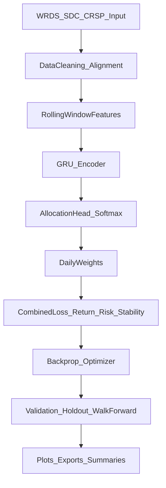
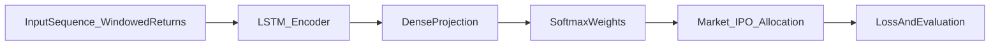
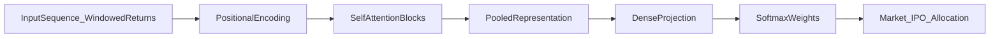
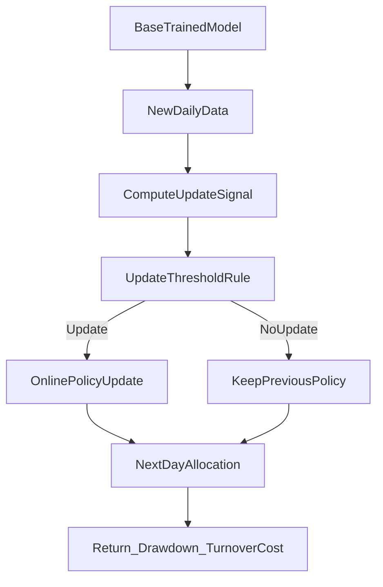

# Technical Presentation Outline (Aligned to Requested Notes)

## Slide 1: Title and Team
- Project title, course, date.
- Team member names on the slide.

## Slide 2: Problem Definition (What We Are Solving)
- Daily allocation between market and IPO sleeves (later expanded to sectors / other sleeves).
- Constraints: long-only, fully invested.
- Why hard: IPOs have high upside but unstable tails and regime shifts.

## Slide 3: Literature Review -> Design Decisions
- Briefly summarize the literature categories:
  - online portfolio optimization,
  - IPO anomaly/risk literature,
  - risk-aware objectives (CVaR, drawdown-aware),
  - sequence models for allocation.
- Explicit narrative: **this literature directly motivated us to update our loss function** instead of only changing models.
- Takeaway line:
  - "The literature pushed us toward objective engineering, not just architecture chasing."

## Slide 4: Updated Loss Function (Core Technical Slide)
- Show old vs new objective at high level.
- Explain each added term in plain language:
  - tail risk,
  - volatility control,
  - diversification,
  - turnover/path stability,
  - optional benchmark/log-growth terms.
- Include one "why" per term.

## Slide 5: Hyperparameters, Batch Size, and Peripheral Training Changes
- Show what was varied:
  - learning rate/schedules,
  - batch size,
  - regularization strengths,
  - clipping/stability settings.
- Emphasize this finding:
  - these settings often moved results as much as architecture changes.

## Slide 6: Context Window + Walk-Forward + Training-Up-to-the-Day
- Context window experiments (short vs long memory).
- Walk-forward setup and why it reduces false confidence.
- "Training up to the day" / online-style framing:
  - fit on available history,
  - test on future only,
  - compare update vs no-update behavior.
- Suggested visuals:
  - `figures/old diagrams/context_window_comparison.png`
  - `figures/online_evaluation/online_cumulative_returns.png`

## Slide 7: Model Architecture Slide - LSTM
- Dedicated model slide with LSTM diagram.
- What we expected LSTM to improve.
- What actually happened (mixed/conditional gains).
- Visuals:
  - `figures/ipo_optimizer/comparison/gru_vs_lstm_train_and_val_loss.png`
  - `figures/daily_projection/train_val_loss_gru_lstm.png`

## Slide 8: Model Architecture Slide - Transformer
- Dedicated model slide with transformer diagram.
- Why we tried it.
- Honest result: did not consistently justify extra complexity/runtime in this setting.
- Visuals:
  - transformer-specific ablation or comparison figures in `figures/old diagrams/wrds_ablation_loss/`.

## Slide 9: Current Working Architecture Flowchart (GRU-Based)
- One system flowchart showing all components end-to-end:
  - data sources -> preprocessing -> rolling windows -> GRU encoder -> output head(s) -> loss terms -> evaluation stack.
- This is the "how all pieces fit together" slide.

## Slide 10: Updated Results / Graphs
- Present refreshed results (not legacy numbers).
- Use current branch outputs and clearly state period/split.
- Include:
  - cumulative returns,
  - risk metric summary,
  - one sentence that says whether this update improved or regressed behavior.

## Slide 11: Commodities / Cross-Asset-Class Slide
- Show how framework behavior changes across asset-class settings (or proxy sleeves).
- Explicitly indicate where IPO sleeve causes performance instability/problems.
- Goal:
  - demonstrate general framework behavior,
  - be honest about IPO-specific weaknesses.

## Slide 12: Online Policy Changes (New Experiment Slide)
- Summarize the online update policy changes you just tested:
  - update-vs-no-update behavior,
  - turnover/cost tradeoff,
  - whether updates improved near-term returns or mostly added noise/cost.
- Keep this slide empirical and honest: show both benefit and side effects.
- Suggested visuals:
  - `figures/online_evaluation/online_cumulative_returns.png`
  - `figures/online_evaluation/online_drawdowns.png`
  - `figures/online_evaluation/online_turnover_cost.png`
  - `figures/online_evaluation/online_update_vs_no_update_future_return_hist.png`
  - `figures/online_evaluation/online_update_val_delta_vs_future_return.png`
- One-sentence takeaway template:
  - "Online updates improved [metric] in [regime], but increased [cost/instability], so update frequency and policy threshold need tuning."

## Slide 13: Worked / Failed / Regressed + Q&A Backup
- Three-column summary:
  - what worked,
  - what failed or was mixed,
  - what worsened performance.
- Keep backup metric definitions and split timeline for Q&A.

---

## Ready-to-Use Narrative Lines

Use these as speaker-script starters so each technical section has a clear story:

- **Literature -> loss update:** "After reviewing online portfolio and risk-aware optimization literature, we stopped treating this as only a model-selection problem and re-framed it as an objective-design problem."
- **Hyperparameters/peripheral tuning:** "Some of our biggest behavior shifts came from training controls like LR schedule, clipping, and batch size, not from architecture swaps."
- **Context + walk-forward:** "Window length alone did not solve robustness; walk-forward style evaluation helped us understand where performance was regime-specific."
- **Model comparison honesty:** "We tested higher-capacity models, but complexity did not guarantee better real portfolio behavior."
- **Online policy changes:** "Frequent online updates can improve responsiveness, but they can also increase turnover and cost; the update threshold matters."
- **Commodities/cross-asset slide:** "The framework can transfer structurally, but IPO-specific instability remains the toughest sleeve."

---

## Visual Assignment Suggestions (Updated)

- Literature + motivation:
  - 1 compact references slide (manual citations).
- Loss and optimization behavior:
  - `figures/old diagrams/validation_objective.png`
  - `figures/old diagrams/validation_variance.png`
- Hyperparameter/context/eval:
  - `figures/old diagrams/context_window_comparison.png`
  - `figures/old diagrams/model_comparison_vm/scalar_selection_objective_tailq.png`
- LSTM/Transformer model slides:
  - `figures/ipo_optimizer/comparison/gru_vs_lstm_train_and_val_loss.png`
  - `figures/daily_projection/train_val_loss_gru_lstm.png`
  - transformer ablation visuals from `figures/old diagrams/wrds_ablation_loss/`
- Online/up-to-day:
  - `figures/online_evaluation/online_cumulative_returns.png`
  - `figures/online_evaluation/online_drawdowns.png`
  - `figures/online_evaluation/online_turnover_cost.png`
- Updated results:
  - current summary tables/plots from `results/`.

---

## Per-Plot Quality Checklist

- Axes labeled with units and period.
- Legend included and readable.
- Split/date range visible on chart.
- One-sentence takeaway under each plot.
- Backup screenshot for all demo-sensitive visuals.

---

## Q&A Prep (Focused)

- Why did literature lead to a loss update?
  - Prior work highlighted tail risk and objective mismatch; we translated that into explicit loss terms.

- Why not just choose the best model class?
  - In our experiments, objective/selection alignment had larger impact than architecture swaps alone.

- Why include two models that did not work well?
  - To show rigorous negative results and avoid over-claiming.

- How do you avoid overfitting to one split?
  - Walk-forward and future-only evaluation framing, plus transparent reporting of regressions.

---

## Ready-to-Paste Diagram Content

You can paste these directly into Markdown-capable slides or use them as blueprint sketches.

## A) Current Working Architecture (GRU-Based, End-to-End)

## B) LSTM Model Slide Diagram

## C) Transformer Model Slide Diagram

## D) Online Policy Update Diagram

